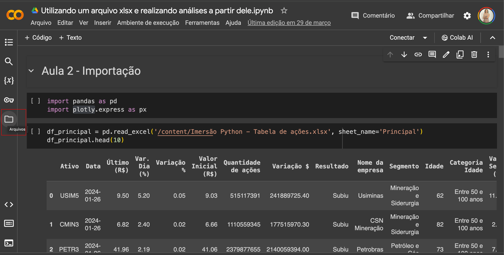
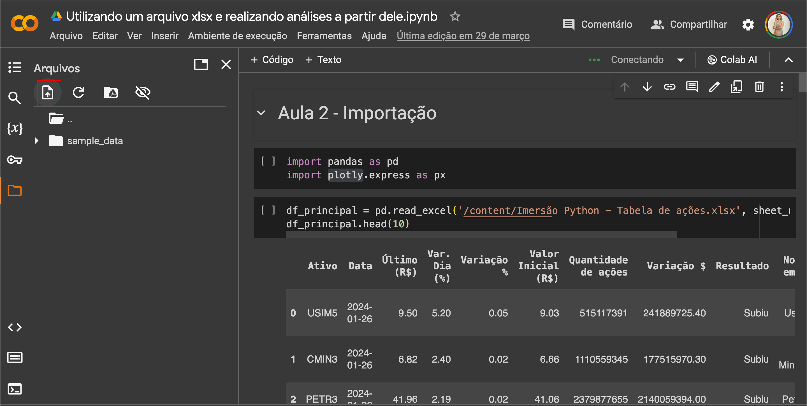

# Imersão Python: Do Excel à Análise de Dados. 

Este repositório contém os arquivos de análise de dados que foram desenvolvidos durante a <b>Imersão Python: Do Excel à Análise de Dados</b>, oferecida pela <b>Alura</b>. 

Durante a imersão, exploramos diversos conceitos e técnicas de análise de dados utilizando a linguagem de programação <b>Python</b> e bibliotecas como <b>Pandas</b>, <b>Matplotlib</b>, <b>Plotly</b>, <b>Mplfinance</b>, <b>Yfinance</b>.
Também realizamos análises utilizando o <b>Google Sheets</b>.

## Conteúdo

- **python**: Este diretório contém os notebooks Jupyter utilizados durante a imersão. Cada notebook aborda um tema específico, incluindo manipulação de dados, visualização, análise exploratória, entre outros.

- **excel**: Este diretório contém um arquivo que possui um conjunto de dados utilizados nas análises. Ele é fornecido em formato **xlsx**. Esse mesmo arquivo é utilizado no notebook **Utilizando um arquivo xlsx e realizando análises a partir dele.ipynb**.

## Como utilizar

- Para executar os notebooks e explorar as análises, você pode utilizar o **Google Colab** para os arquivos com extensão **ipynb** e **Google Sheets** para o arquivo com extensão **xlsx**, pois assim não é necessário realizar nenhuma instalação na sua máquina.
- Para que o notebook **Utilizando um arquivo xlsx e realizando análises a partir dele.ipynb** seja executado com sucesso, é necessário subir o arquivo **xlsx** no Google Colab, utilizando os passos abaixo:
  1. Já com o notebook aberto, clique no ícone com o desenho de arquivo no canto esquerdo:
      
  2. Após o passo 1, clique no ícone de upload de arquivo:
      
  3. Após isso, você já consegue rodar o notebook com sucesso.

## Resumo sobre a experiência
Durante a imersão **Imersão Python: Do Excel à Análise de Dados** oferecida pela **Alura**, tive a oportunidade de aprofundar meus conhecimentos em Python e explorar técnicas de análise de dados. Durante a semana intensiva de aprendizado, fui revisto os conceitos fundamentais de Python, aprendi a manipular dados de forma eficiente com a biblioteca Pandas e a visualizar insights com Matplotlib. Além disso, explorei técnicas de análise de dados exploratória, tanto no **Python** como no **Google Sheets**.

Minha experiência durante a imersão foi extremamente enriquecedora, pois pude aplicar os conceitos aprendidos em projetos práticos. Através de análises de dados reais, desenvolvi habilidades essenciais em Python e análise de dados, e venho estudando cada vez mais para me aperfeiçoar.

Esta imersão não apenas solidificou meu conhecimento em Python, mas também me proporcionou uma compreensão mais profunda do processo de análise de dados e sua aplicação no mundo real. Estou confiante de que os conhecimentos adquiridos durante esta imersão serão inestimáveis para o meu crescimento profissional contínuo.